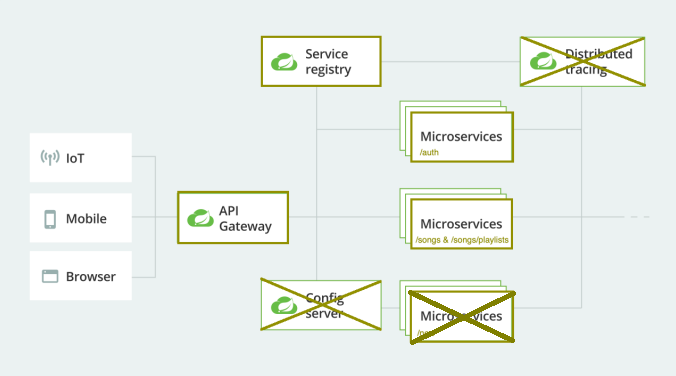

# Beleg 4

Bearbeitsungszeit: 2 Wochen

## Kontext

Sie arbeiten derzeit an einem großen Monolithen, der von einem einzigen Team/einer einzigen Person verwaltet wird. Üblicherweise arbeiten in einem Unternehmen mehrere Teams, die jeweils ihre eigenen Dienste bereitstellen und bei Bedarf mit anderen Diensten kommunizieren. 

In diesem Beleg simulieren wir dies und führen ein Refactoring durch. Dazu soll der Monolith in zwei unabhängige Dienste aufgeteilt und ein Gateway als zentralen Kommunikationspunkt für die Clients hinzugefügt werden. Zudem fügen wir 

## Aufgaben

### Microservice-basierte Architektur

Der Monolith soll in zwei Microservices aufgeteilt werden:

- /auth
- /songs & /songsList

1. Richten sie ihre Github Repositorien ein:

   Entweder

   1. Erstellen sie eine neue Github Organisation unter ihrem Teamnamen
   2. Laden sie ihre Teammitglieder + htwb-steven in die Github Organisation ein
   3. Erstellen Sie für jeden Microservice ein Repository. In jedem Repository sollte der Build+Run+Test-Prozess in der README dokumentiert sein. Zusätzlich sollten Sie innerhalb der Organisation ein neues Repository mit dem Namen des Teams erstellen, das eine README.md enthält, die die Dokumentation für den Build+Run+Test-Prozess Ihres gesamten Projekts enthält.

   **oder**

   1. Erstellen sie auf ihrem eigenen Account ein neues Repository
   2. Im Repository erstellen für jeden Microservice ein Unterprojekt/Unterordner.
   3. Jeder Unterordner enthält eine README mit dem Build+Run+Test Prozess. Im Oberordner sollte sich eine README.md mit der Dokumentation für den Build+Run+Test-Prozess des gesamten Projekts befinden.

2. Jeder Microservice muss eine eigene Datenbank nutzen.

3. Jeder Microservice hat eine Swagger Dokumentation. 

4. Jeder Microservice hat eigene Tests. 

Ein API-Gateway soll als zentraler und einziger Zugangspunkt für alle Nutzer dienen. Das API-Gateway kann Anfragen auf zwei Arten bearbeiten:

- Einige Anfragen werden einfach an den entsprechenden Dienst weitergeleitet. 
- Andere Anfragen werden durch Auffächern auf mehrere Dienste bearbeitet.

1. Implementieren sie einen Gateway für ihre Microservices. Nutzen sie dafür Spring Cloud Gateway	 https://spring.io/projects/spring-cloud-gateway 
2. Fügen sie eine Swagger Dokumentation für ihren Gateway hinzu. 

